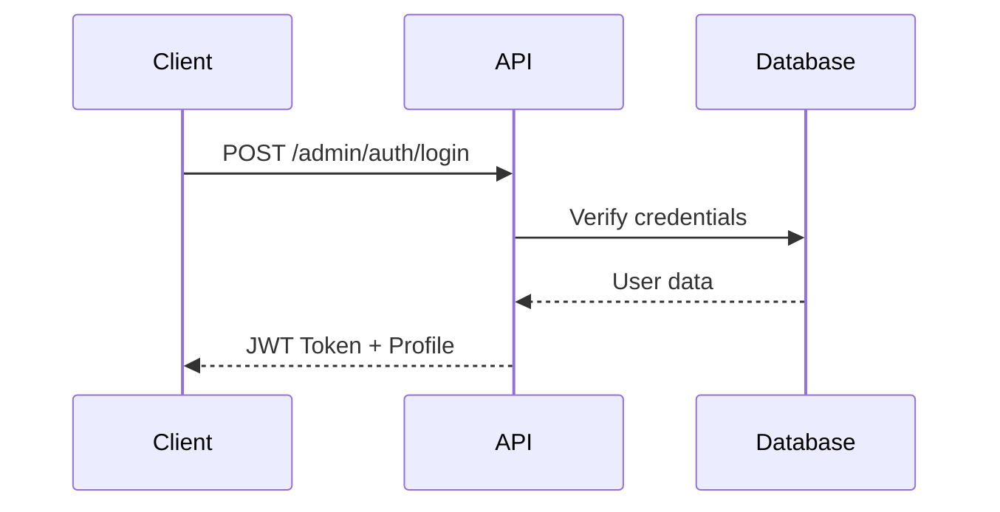
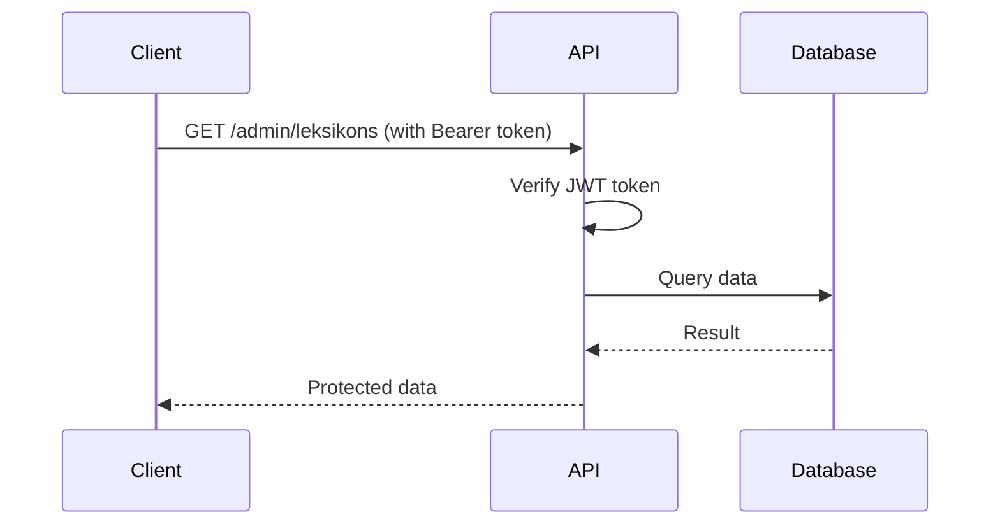

# Dokumentasi Proyek Leksikon Backend untuk Skripsi

*Last Updated: December 17, 2025*

## 📋 Daftar Isi

1. [Deskripsi Pengguna](#41-deskripsi-pengguna)
2. [Kebutuhan Pengguna](#42-kebutuhan-pengguna)
3. [Permodelan Kebutuhan](#43-permodelan-kebutuhan)
4. [Arsitektur Sistem](#44-arsitektur-sistem)
5. [Dokumentasi API](#45-dokumentasi-api)
6. [Analisis Endpoint](#analisis-endpoint)

---

## 📝 Recent Updates (December 2025)

### December 17, 2025 - API Usage Analysis
- ✅ **Complete Endpoint Analysis**: Detailed analysis of 148 endpoints (admin + public)
- ✅ **Frontend-Backend Validation**: Cross-reference dengan actual frontend API calls
- ✅ **Usage Statistics**: 97 endpoints digunakan (65.5% utilization)
- ✅ **Missing Endpoints Identified**: 14 endpoints diminta frontend tapi belum ada
- ✅ **Unused Endpoints Documented**: 36 endpoints tersedia tapi tidak digunakan
- ✅ **API Perfect Score**: 5 modul API dengan 100% utilization rate

### December 11, 2025 - Reference Management
- ✅ **Reference Management System**: Complete implementation of about-references and reference-junctions APIs
- ✅ **Data Import Completion**: Successfully imported 131 lexicons, 13 domains, and 41 lexicon assets
- ✅ **Reference Assignment Features**: Junction tables for linking references to lexicons, subcultures, and cultures
- ✅ **About Page References**: Dedicated management for references displayed on about page with ordering
- ✅ **Reference Usage Statistics**: Comprehensive tracking of reference usage across content entities
- ✅ **Complete API Documentation**: Comprehensive documentation for all admin and public endpoints
- ✅ **Enhanced Asset Filtering**: Combined search and filter capabilities in asset endpoints
- ✅ **Geographic Coordinates**: Support for latitude/longitude coordinates in cultures (not PostGIS)
- ✅ **Public API Integration**: Detailed documentation with frontend usage notes
- ✅ **Database Optimization**: Improved query performance and data relationships
- ✅ **Bulk Import Production Fix**: CSV bulk import now compatible with Vercel serverless environment

---

## 4.1 Deskripsi Pengguna

### 4.1.1 Identifikasi Pengguna

Sistem Leksikon Backend memiliki **2 kategori pengguna utama** berdasarkan level akses sistem:

#### 1. Admin (Authenticated User)
- **Karakteristik**: 
  - Staff atau dosen FIB yang bertanggung jawab mengelola konten leksikon
  - Memiliki akses penuh ke sistem admin
  - Dapat melakukan CRUD operations pada semua entitas
  - Memerlukan autentikasi untuk mengakses sistem
- **Kebutuhan Akses**:
  - Authentication dengan JWT token
  - Role-based access control (SUPER_ADMIN, EDITOR, VIEWER)
  - Akses ke semua endpoint admin (`/api/v1/admin/*`)
- **Fitur yang Digunakan**:
  - CRUD operations untuk semua entitas
  - Media management (upload, update, delete)
  - Bulk import dari CSV/Excel
  - Reference assignment dan tracking
  - Status management (DRAFT, PUBLISHED, ARCHIVED)

#### 2. Public User (Unauthenticated User)
- **Karakteristik**:
  - Pengunjung website yang ingin mempelajari leksikon budaya
  - Termasuk peneliti, akademisi, dan masyarakat umum
  - Tidak memerlukan autentikasi
  - Hanya dapat melihat konten yang sudah dipublikasikan (status: PUBLISHED)
- **Kebutuhan Akses**:
  - Akses read-only ke public endpoints (`/api/v1/public/*`)
  - Akses ke search endpoints (`/api/v1/search/*`)
  - Browsing leksikon, subkultur, dan budaya
  - Search dan filter capabilities
- **Fitur yang Digunakan**:
  - Browse published content (leksikon, subculture, culture)
  - Global search dan advanced search
  - View references dan contributors
  - Access media files (assets)

---

## 4.2 Kebutuhan Pengguna

### 4.2.1 Identifikasi Pengguna (Actor Identification)

| Actor | Deskripsi | Akses | Endpoints |
|-------|-----------|-------|----------|
| **Admin** | Staff/dosen FIB yang mengelola sistem | Full access dengan JWT authentication | `/api/v1/admin/*` |
| **Public User** | Pengunjung website (peneliti, akademisi, umum) | Read-only tanpa authentication | `/api/v1/public/*`, `/api/v1/search/*` |

### 4.2.2 Kebutuhan Fungsional

#### ✅ Authentication & Authorization
- [x] Admin registration (`POST /api/v1/admin/auth/register`)
- [x] Admin login (`POST /api/v1/admin/auth/login`)
- [x] Get admin profile (`GET /api/v1/admin/auth/profile`)
- [x] Change password (`PUT /api/v1/admin/auth/change-password`)
- [x] Update profile (`PUT /api/v1/admin/auth/update-profile`)
- [x] Update admin status (`PUT /api/v1/admin/auth/admins/:id/status`)
- [x] JWT token authentication middleware
- [x] Role-based access control (SUPER_ADMIN, EDITOR, VIEWER)

#### ✅ CRUD Operations untuk Leksikon
- [x] Create leksikon (`POST /api/v1/admin/leksikons`)
- [x] Read all leksikons dengan pagination (`GET /api/v1/admin/leksikons`)
- [x] Read leksikon by ID (`GET /api/v1/admin/leksikons/:id`)
- [x] Update leksikon (`PUT /api/v1/admin/leksikons/:id`)
- [x] Delete leksikon (`DELETE /api/v1/admin/leksikons/:id`)
- [x] Update leksikon status (`PATCH /api/v1/admin/leksikons/:id/status`)

#### ✅ Media Management
- [x] Upload single asset (`POST /api/v1/admin/assets/upload`)
- [x] Bulk upload assets (`POST /api/v1/admin/assets/bulk-upload`)
- [x] Get asset by ID (`GET /api/v1/admin/assets/:id`)
- [x] Update asset (`PUT /api/v1/admin/assets/:id`)
- [x] Delete asset (`DELETE /api/v1/admin/assets/:id`)
- [x] Search assets (`GET /api/v1/admin/assets/search`)
- [x] Filter assets (`GET /api/v1/admin/assets/filter`)
- [x] Public asset access (`GET /api/v1/public/assets/:id/file`)
- [x] Asset role management untuk leksikon
- [x] Asset role management untuk subculture
- [x] Asset role management untuk culture
- [x] Asset role management untuk contributor

#### ✅ Search & Filtering
- [x] Global search (`GET /api/v1/search/global`)
- [x] Advanced search (`GET /api/v1/search/advanced`)
- [x] Search lexicons (`GET /api/v1/search/lexicon`)
- [x] Search references (`GET /api/v1/search/references`)
- [x] Search contributors (`GET /api/v1/search/coordinator`)
- [x] Search cultures (`GET /api/v1/search/culture`)
- [x] Filter by status (DRAFT, PUBLISHED, ARCHIVED)
- [x] Filter by domain kodifikasi
- [x] Filter by geographic location (latitude/longitude coordinates)
- [x] Filter by conservation status
- [x] Filter by reference type
- [x] Filter by asset type

#### ✅ Bulk Import dari Excel/CSV
- [x] Bulk import leksikons dari CSV (`POST /api/v1/admin/leksikons/import`)
- [x] Flexible header mapping
- [x] Batch processing
- [x] Error handling dan reporting
- [x] Import summary (success, skipped, errors)

#### ✅ API Endpoints (Admin & Public)
- [x] Admin endpoints dengan authentication
- [x] Public endpoints tanpa authentication
- [x] Pagination support
- [x] Error handling yang konsisten
- [x] Response format yang standar

---

## 4.3 Permodelan Kebutuhan

### 4.3.1 Use Case Diagram

#### Use Cases untuk Admin:
1. **Authenticate** - Login dan register admin
2. **Manage Leksikon** - CRUD operations untuk leksikon
3. **Manage Domain Kodifikasi** - CRUD operations untuk domain
4. **Manage Subculture** - CRUD operations untuk subkultur
5. **Manage Culture** - CRUD operations untuk budaya
6. **Manage Contributor** - CRUD operations untuk kontributor
7. **Manage Reference** - CRUD operations untuk referensi
8. **Manage About References** - Manage references untuk halaman about dengan ordering
9. **Assign References** - Assign references ke lexicon, subculture, culture via junction tables
10. **Track Reference Usage** - Monitor penggunaan references across entities
11. **Manage Asset** - Upload, update, delete media files
12. **Bulk Import** - Import data dari CSV/Excel
13. **Search & Filter** - Advanced search dan filtering
14. **Track Usage** - Track penggunaan assets dan references
15. **Update Status** - Update status publish (DRAFT, PUBLISHED, ARCHIVED)

#### Use Cases untuk Public User:
13. **Browse Leksikon** - Browse leksikon yang dipublikasikan
14. **Search Leksikon** - Search leksikon dengan berbagai kriteria (global & advanced)
15. **View Subculture** - View detail subkultur
16. **View Culture** - View detail budaya dan peta budaya
17. **View References** - View referensi akademik
18. **View Contributors** - View kontributor dan koordinator
19. **Access Media** - Access media files yang dipublikasikan

### 4.3.2 Activity Diagram

#### 1. Login Flow
```
Start → Input Email & Password → Validate Credentials → 
Generate JWT Token → Return Token & Profile → End
```

#### 2. Upload & Manage Leksikon
```
Start → Authenticate → Create/Update Leksikon → 
Validate Data → Save to Database → 
Link Assets/References (optional) → Return Response → End
```

#### 3. Bulk Import Excel
```
Start → Authenticate → Upload CSV File → 
Parse CSV → Validate Each Row → 
Batch Insert to Database → 
Generate Summary (success/skipped/errors) → Return Response → End
```

#### 4. Search & Filtering
```
Start → Receive Query/Filter → 
Build Database Query → 
Execute Query → 
Format Results → 
Return Paginated Results → End
```

#### 5. Media Upload
```
Start → Authenticate → Upload File → 
Validate File Type & Size → 
Upload to Blob Storage → 
Save Metadata to Database → 
Return Asset Info → End
```

---

## 4.4 Arsitektur Sistem

### 4.4.1 Multi-Layer Architecture

```
┌─────────────────────────────────────────┐
│         CLIENT LAYER                    │
│  (React/Next.js Frontend)               │
└─────────────────┬───────────────────────┘
                  │
┌─────────────────▼───────────────────────┐
│         API GATEWAY                    │
│  - Express.js Router                   │
│  - CORS Middleware                     │
│  - Authentication Middleware           │
│  - Error Handling                      │
└─────────────────┬───────────────────────┘
                  │
┌─────────────────▼───────────────────────┐
│      BACKEND SERVICES                   │
│  - Controllers (Request Handling)       │
│  - Services (Business Logic)            │
│  - Validators (Data Validation)        │
└─────────────────┬───────────────────────┘
                  │
┌─────────────────▼───────────────────────┐
│      DATABASE LAYER                     │
│  - Prisma ORM                           │
│  - PostgreSQL Database                  │
│  - PostgreSQL Database                  │
└─────────────────┬───────────────────────┘
                  │
┌─────────────────▼───────────────────────┐
│    CLOUD STORAGE LAYER                  │
│  - Vercel Blob Storage                 │
│  - Media Files (Photos, Audio, Video)  │
└─────────────────────────────────────────┘
```

### 4.4.2 Technology Stack

- **Runtime**: Node.js dengan TypeScript
- **Framework**: Express.js v5.1.0
- **ORM**: Prisma v6.16.2
- **Database**: PostgreSQL
- **Authentication**: JWT (jsonwebtoken) + bcrypt
- **File Storage**: Vercel Blob Storage
- **File Upload**: Multer
- **Validation**: Zod

---

## 4.5 Dokumentasi API (Spesifikasi Tingkat Tinggi)

### 4.5.1 Authentication API

**Base Path**: `/api/v1/admin/auth`

| Method | Endpoint | Deskripsi | Auth Required |
|--------|----------|-----------|---------------|
| POST | `/register` | Register admin baru | ❌ |
| POST | `/login` | Login admin | ❌ |
| GET | `/profile` | Get profile admin saat ini | ✅ |
| PUT | `/change-password` | Ubah password | ✅ |
| PUT | `/update-profile` | Update profile admin | ✅ |
| PUT | `/admins/:id/status` | Update status admin | ✅ |

**Request Body (Register)**:
```json
{
  "username": "string (3-50 chars)",
  "email": "string (valid email)",
  "password": "string (min 8 chars)",
  "role": "SUPER_ADMIN | EDITOR | VIEWER (optional, default: EDITOR)"
}
```

**Response (Login)**:
```json
{
  "success": true,
  "token": "jwt_token_string",
  "admin": {
    "adminId": 1,
    "username": "admin",
    "email": "admin@example.com",
    "role": "EDITOR"
  }
}
```

---

### 4.5.2 Domain Kodifikasi API

**Base Path**: `/api/v1/admin/domain-kodifikasi`

| Method | Endpoint | Deskripsi | Auth Required |
|--------|----------|-----------|---------------|
| GET | `/` | Get all domains (paginated) | ✅ |
| POST | `/` | Create domain baru | ✅ |
| GET | `/:id` | Get domain by ID | ✅ |
| PUT | `/:id` | Update domain | ✅ |
| DELETE | `/:id` | Delete domain | ✅ |
| GET | `/filter` | Filter domains (code, status) | ✅ |
| GET | `/search` | Search domains (q parameter) | ✅ |

**Request Body (Create)**:
```json
{
  "code": "string",
  "domainName": "string",
  "explanation": "string",
  "subcultureId": "number",
  "status": "DRAFT | PUBLISHED | ARCHIVED"
}
```

---

### 4.5.3 Leksikon API

**Base Path**: `/api/v1/admin/leksikons`

| Method | Endpoint | Deskripsi | Auth Required |
|--------|----------|-----------|---------------|
| GET | `/` | Get all leksikons (paginated) | ✅ |
| POST | `/` | Create leksikon baru | ✅ |
| GET | `/:id` | Get leksikon by ID | ✅ |
| PUT | `/:id` | Update leksikon | ✅ |
| DELETE | `/:id` | Delete leksikon | ✅ |
| PATCH | `/:id/status` | Update leksikon status | ✅ |
| GET | `/status` | Filter by status | ✅ |
| GET | `/domain-kodifikasi/:dk_id/leksikons` | Filter by domain | ✅ |
| GET | `/search/assets` | Search assets in leksikons | ✅ |
| GET | `/search/references` | Search references in leksikons | ✅ |
| GET | `/assets/assigned` | Get assigned assets | ✅ |
| GET | `/assets/:assetId/usages` | Get asset usage | ✅ |
| GET | `/references/assigned` | Get assigned references | ✅ |
| GET | `/references/:referenceId/usages` | Get reference usage | ✅ |
| GET | `/:id/assets` | Get leksikon assets | ✅ |
| POST | `/:id/assets` | Add asset to leksikon | ✅ |
| DELETE | `/:id/assets/:assetId` | Remove asset from leksikon | ✅ |
| PUT | `/:id/assets/:assetId/role` | Update asset role | ✅ |
| GET | `/:id/assets/role/:assetRole` | Get assets by role | ✅ |
| GET | `/:id/references` | Get leksikon references | ✅ |
| POST | `/:id/references` | Add reference to leksikon | ✅ |
| DELETE | `/:id/references/:referenceId` | Remove reference from leksikon | ✅ |
| PUT | `/:id/references/:referenceId` | Update citation note | ✅ |
| GET | `/filter/assets` | Filter assets (type, status, date) | ✅ |
| GET | `/filter/references` | Filter references (type, year, status) | ✅ |
| POST | `/import` | Bulk import dari CSV | ✅ |

**Request Body (Create)**:
```json
{
  "lexiconWord": "string",
  "ipaInternationalPhoneticAlphabet": "string (optional)",
  "transliteration": "string",
  "etymologicalMeaning": "string",
  "culturalMeaning": "string",
  "commonMeaning": "string",
  "translation": "string",
  "variant": "string (optional)",
  "variantTranslations": "string (optional)",
  "otherDescription": "string (optional)",
  "domainId": "number",
  "contributorId": "number",
  "preservationStatus": "MAINTAINED | TREATED | CRITICAL | ARCHIVED",
  "status": "DRAFT | PUBLISHED | ARCHIVED"
}
```

---

### 4.5.4 Media API

**Base Path**: `/api/v1/admin/assets`

| Method | Endpoint | Deskripsi | Auth Required |
|--------|----------|-----------|---------------|
| GET | `/` | Get all assets (paginated) | ✅ |
| GET | `/search` | Search assets | ✅ |
| GET | `/filter` | Filter assets (type, status) | ✅ |
| GET | `/:id` | Get asset by ID | ✅ |
| POST | `/upload` | Upload single asset | ✅ |
| PUT | `/:id` | Update asset | ✅ |
| DELETE | `/:id` | Delete asset | ✅ |
| POST | `/bulk-upload` | Bulk upload assets | ✅ |

**Public Endpoint**:
| Method | Endpoint | Deskripsi | Auth Required |
|--------|----------|-----------|---------------|
| GET | `/api/v1/public/assets/:id/file` | Get public asset file | ❌ |

**Request (Upload)**:
- Content-Type: `multipart/form-data`
- Field: `file` (file upload)
- Body fields: `fileName`, `fileType`, `description`, `url`, `status`

**Asset Types**: `PHOTO`, `AUDIO`, `VIDEO`, `MODEL_3D`
**Asset Status**: `ACTIVE`, `PROCESSING`, `ARCHIVED`, `CORRUPTED`, `PUBLISHED`

---

### 4.5.5 Search API

**Base Path**: `/api/v1/search`

| Method | Endpoint | Deskripsi | Auth Required |
|--------|----------|-----------|---------------|
| GET | `/global` | Global search (formatted) | ❌ |
| GET | `/` | Global search (raw) | ❌ |
| GET | `/lexicon` | Search lexicons | ❌ |
| GET | `/advanced` | Advanced search dengan filters | ❌ |
| GET | `/references` | Search references | ❌ |
| GET | `/coordinator` | Search contributors | ❌ |
| GET | `/culture` | Search cultures | ❌ |

**Query Parameters (Advanced Search)**:
```
?query=string
&culture=string
&subculture=string
&domain=string
&region=string
&status=string
&page=number
&limit=number
```

---

### 4.5.6 Subculture API

**Base Path**: `/api/v1/admin/subcultures`

| Method | Endpoint | Deskripsi | Auth Required |
|--------|----------|-----------|---------------|
| GET | `/` | Get all subcultures (paginated) | ✅ |
| POST | `/` | Create subculture | ✅ |
| GET | `/:id` | Get subculture by ID | ✅ |
| PUT | `/:id` | Update subculture | ✅ |
| DELETE | `/:id` | Delete subculture | ✅ |
| GET | `/filter` | Filter subcultures | ✅ |
| GET | `/:id/assigned-assets` | Get assigned assets | ✅ |
| GET | `/:id/assigned-references` | Get assigned references | ✅ |
| POST | `/:id/references` | Add reference to subculture (assign ke leksikon) | ✅ |
| POST | `/:id/references-direct` | Add reference directly to subculture page | ✅ |
| GET | `/:id/references-direct` | Get references assigned directly to subculture | ✅ |
| DELETE | `/:id/references-direct/:referenceId` | Remove reference from subculture page | ✅ |
| GET | `/:id/filter-assets` | Filter assets | ✅ |
| GET | `/:id/filter-references` | Filter references | ✅ |
| GET | `/:id/search-assets` | Search assets | ✅ |
| GET | `/:id/search-references` | Search references | ✅ |
| GET | `/assets/:assetId/usage` | Get asset usage | ✅ |
| GET | `/references/:referenceId/usage` | Get reference usage | ✅ |
| GET | `/:id/assets` | Get subculture assets | ✅ |
| POST | `/:id/assets` | Add asset to subculture | ✅ |
| DELETE | `/:id/assets/:assetId` | Remove asset from subculture | ✅ |
| GET | `/:cultureId/subcultures` | Get subcultures by culture | ✅ |

**Public Endpoints** (`/api/v1/public/subcultures`):
| Method | Endpoint | Deskripsi | Auth Required |
|--------|----------|-----------|---------------|
| GET | `/` | Get subcultures gallery | ❌ |
| GET | `/:identifier` | Get subculture detail | ❌ |
| GET | `/:identifier/lexicon` | Get subculture lexicons | ❌ |

---

### 4.5.7 Culture API

**Base Path**: `/api/v1/admin/cultures`

| Method | Endpoint | Deskripsi | Auth Required |
|--------|----------|-----------|---------------|
| GET | `/` | Get all cultures (paginated) | ✅ |
| POST | `/` | Create culture | ✅ |
| GET | `/:id` | Get culture by ID | ✅ |
| PUT | `/:id` | Update culture | ✅ |
| DELETE | `/:id` | Delete culture | ✅ |
| GET | `/search` | Search cultures | ✅ |
| GET | `/filter` | Filter cultures | ✅ |
| GET | `/cultures/:cultureId` | Get culture with assets | ✅ |
| POST | `/:id/references` | Add reference to culture (for about page) | ✅ |
| GET | `/:id/references` | Get references assigned to culture | ✅ |
| DELETE | `/:id/references/:referenceId` | Remove reference from culture | ✅ |

**Public Endpoints** (`/api/v1/public/about`):
| Method | Endpoint | Deskripsi | Auth Required |
|--------|----------|-----------|---------------|
| GET | `/` | Get about page data (culture with references) | ❌ |

**Request Body (Add Reference)**:
```json
{
  "referenceId": 1,
  "citationNote": "DIRECT_QUOTE",  // Optional
  "displayOrder": 2                 // Optional, default: 0
}
```

---

### 4.5.8 Bulk Import API

**Base Path**: `/api/v1/admin/leksikons`

| Method | Endpoint | Deskripsi | Auth Required |
|--------|----------|-----------|---------------|
| POST | `/import` | Bulk import dari CSV | ✅ |

**Request**:
- Content-Type: `multipart/form-data`
- Field: `file` (CSV file)

**CSV Format**:
- Headers: `Leksikon`, `Transliterasi`, `Makna Etimologi`, `Makna Kultural`, `Common Meaning`, `Translation`, `Varian`, `Translation varians`, `Deskripsi Lain`, `Domain ID`, `Contributor ID`, `Slug` (optional)
- Slug akan auto-generated dari `lexiconWord` jika tidak disediakan

**Response**:
```json
{
  "success": true,
  "message": "Bulk import completed",
  "data": {
    "imported": 100,
    "skipped": 5,
    "errors": ["Error message 1", "Error message 2"],
    "importedLexicons": ["lexicon1", "lexicon2"],
    "skippedLexicons": ["lexicon3"]
  }
}
```

---

## Analisis Endpoint

### 📊 Statistik Endpoint (Updated: December 17, 2025)

**Total Endpoint**: ~148 endpoints

```
┌────────────────────────────────────────────────────────────────────┐
│                    RINGKASAN ENDPOINT                              │
├──────────────────┬────────────┬────────────┬────────────┬──────────┤
│ Kategori         │ ✅ Digunakan│ ❌ Tidak Ada│ ⚠️ Unused │ Total   │
├──────────────────┼────────────┼────────────┼────────────┼──────────┤
│ ADMIN API        │     85     │     14     │     23     │   122    │
│ PUBLIC API       │     12     │      0     │     13     │    26    │
├──────────────────┼────────────┼────────────┼────────────┼──────────┤
│ TOTAL            │     97     │     14     │     36     │   ~148   │
└──────────────────┴────────────┴────────────┴────────────┴──────────┘
```

#### Admin Endpoints: 122 endpoints

| Kategori | ✅ Digunakan | ❌ Tidak Ada | ⚠️ Unused | Total |
|----------|-------------|-------------|-----------|-------|
| Auth & Admin | 5 | 3 | 2 | 10 |
| Leksikon | 22 | 1 | 4 | 27 |
| Subcultures | 13 | 4 | 3 | 20 |
| Cultures | 5 | 4 | 6 | 15 |
| Assets | 7 | 0 | 1 | 8 |
| References | 7 | 0 | 0 | 7 |
| Contributors | 5 | 0 | 5 | 10 |
| Domain Kodifikasi | 5 | 1 | 2 | 8 |
| Reference Junctions | 10 | 0 | 0 | 10 |
| About References | 6 | 0 | 0 | 6 |
| Asset Roles | 0 | 1 | 0 | 1 |

#### Public Endpoints: 26 endpoints

| Kategori | ✅ Digunakan | ⚠️ Unused | Total |
|----------|-------------|-----------|-------|
| Landing Page | 1 | 1 | 2 |
| Subcultures | 2 | 1 | 3 |
| Lexicons | 1 | 1 | 2 |
| Search | 4 | 3 | 7 |
| Cultures | 0 | 3 | 3 |
| Contributors | 1 | 1 | 2 |
| References | 1 | 1 | 2 |
| Domains | 0 | 2 | 2 |
| Regions | 1 | 0 | 1 |
| About | 1 | 0 | 1 |
| Assets | 0 | 1 | 1 |

---

### ✅ Endpoint yang Digunakan (Divalidasi dari Frontend)

#### Admin Endpoints yang Digunakan (85 endpoints):

**Authentication (5 endpoints):**
- ✅ `POST /admin/auth/login` - Login admin
- ✅ `POST /admin/auth/register` - Register admin baru
- ✅ `GET /admin/profile` - Get profil admin
- ✅ `PUT /admin/update-profile` - Update profil
- ✅ `PUT /admin/change-password` - Ganti password

**Leksikon (22 endpoints):**
- ✅ CRUD Operations (5): GET, POST, PUT, DELETE, PATCH status
- ✅ Assets (8): Get, Add, Remove, Update role, Filter, Search, Usage
- ✅ References (7): Get, Add, Remove, Update citation, Filter, Search
- ✅ Import (1): Bulk import CSV
- ✅ Filter (1): Filter by status

**Subcultures (13 endpoints):**
- ✅ CRUD Operations (6): GET all, GET by ID, POST, PUT, DELETE, Filter
- ✅ Assets (7): Get, Add, Remove, Assigned, Search, Filter, Usage

**Cultures (5 endpoints):**
- ✅ CRUD Operations (5): GET all, GET by ID, POST, PUT, DELETE

**Assets (7 endpoints):**
- ✅ GET, GET by ID, POST upload, PUT, DELETE, Search, Filter

**References (7 endpoints) - SEMPURNA:**
- ✅ GET, GET by ID, POST, PUT, DELETE, Search, Filter

**Contributors (5 endpoints):**
- ✅ GET, GET by ID, POST, PUT, DELETE

**Domain Kodifikasi (5 endpoints):**
- ✅ GET, GET by ID, POST, PUT, DELETE

**Reference Junctions (10 endpoints) - SEMPURNA:**
- ✅ Lexicon assign, remove, get (3)
- ✅ Subculture assign, remove, get (3)
- ✅ Culture assign, remove, get (3)
- ✅ Stats (1)

**About References (6 endpoints) - SEMPURNA:**
- ✅ GET, GET by ID, POST, PUT, DELETE, Reorder

#### Public Endpoints yang Digunakan (12 endpoints):

| # | Endpoint | Fungsi | Halaman |
|---|----------|--------|---------|
| 1 | `GET /public/landing` | Landing page data | Homepage |
| 2 | `GET /public/subcultures` | Subcultures gallery | Peta budaya |
| 3 | `GET /public/subcultures/:identifier` | Detail subculture | Detail page |
| 4 | `GET /public/lexicons/:identifier` | Detail leksikon | Detail page |
| 5 | `GET /search/global` | Global search | Search |
| 6 | `GET /search/advanced` | Advanced search | Search page |
| 7 | `GET /search/references` | Search references | References |
| 8 | `GET /search/coordinator` | Search contributors | Contributors |
| 9 | `GET /public/contributors` | Contributors list | Contributors |
| 10 | `GET /public/references` | References list | References |
| 11 | `GET /public/regions/:regionId` | Region data | Map popup |
| 12 | `GET /public/about` | About page | About |

---

### ❌ Endpoint yang Diminta Frontend tapi BELUM ADA (14 endpoints)

#### High Priority - Perlu Ditambahkan:

| # | Endpoint | Keterangan |
|---|----------|------------|
| 1 | `GET /admin/auth/verify` | Verifikasi token JWT |
| 2 | `GET /admin/settings` | Get settings aplikasi |
| 3 | `PUT /admin/settings/notifications` | Update notifikasi settings |
| 4 | `PUT /admin/settings/app` | Update app settings |
| 5 | `GET /admin/leksikons/filter` | Filter by status + domain |
| 6 | `GET /admin/cultures/:id/assets` | Get culture assets |
| 7 | `POST /admin/cultures/:id/assets` | Add culture asset |
| 8 | `PUT /admin/cultures/:id/assets/:assetId` | Update culture asset |
| 9 | `DELETE /admin/cultures/:id/assets/:assetId` | Remove culture asset |
| 10 | `GET /admin/subcultures/:id/references` | Get subculture refs (naming issue) |
| 11 | `GET /admin/subcultures/:id/search-references` | Search subculture refs |
| 12 | `GET /admin/domain-kodifikasi/:id/leksikons` | Get leksikons by domain |

#### Low Priority:
| 13 | `GET /admin/asset-roles` | Get all asset roles (bisa hardcode) |
| 14 | `GET /admin/admins/:id/status` | Update admin status |

---

### ⚠️ Endpoint yang TERSEDIA tapi TIDAK DIGUNAKAN (36 endpoints)

#### Admin Unused (23 endpoints):
1. `PUT /admin/admins/:id/status` - Update admin status
2. `GET /admin/leksikons/:id/assets/role/:assetRole` - Get assets by role
3. `GET /admin/leksikons/filter/references` - Filter references
4. `GET /admin/leksikons/references/:referenceId/usages` - Reference usage
5. `GET /admin/leksikons/domain-kodifikasi/:dk_id/leksikons` - By domain
6. `GET/POST/DELETE /admin/subcultures/:id/references-direct` - Direct refs (3)
7. `GET /admin/cultures/search` - Search cultures
8. `GET /admin/cultures/filter` - Filter cultures
9. `GET /admin/cultures/cultures/:cultureId` - Get with assets
10. `GET/POST/DELETE /admin/cultures/:id/references` - Culture refs (3)
11. `POST /admin/assets/bulk-upload` - Bulk upload assets
12. `GET/POST/DELETE /admin/contributors/:id/assets` - Contributor assets (3)
13. `GET /admin/contributors/search` - Search contributors
14. `GET /admin/contributors/filter` - Filter contributors
15. `GET /admin/domain-kodifikasi/search` - Search domains
16. `GET /admin/domain-kodifikasi/filter` - Filter domains

#### Public Unused (13 endpoints):
1. `POST /public/landing/contact` - Contact form
2. `GET /public/subcultures/:id/lexicon` - Subculture lexicons
3. `GET /public/lexicons` - All lexicons list
4. `GET /search` - Global search raw
5. `GET /search/lexicon` - Search lexicon
6. `GET /search/culture` - Search culture
7. `GET /public/cultures` - All cultures
8. `GET /public/cultures/:id` - Culture detail
9. `GET /public/cultures/:id/search` - Culture search
10. `GET /public/contributors/:id` - Contributor detail
11. `GET /public/references/:id` - Reference detail
12. `GET /domains/:domain_id` - Domain detail
13. `GET /domains/:domain_id/search` - Domain search

---

### 📝 Catatan Penting

#### 1. Naming Convention Issue:
- **Frontend meminta:** `/admin/subcultures/:id/references`
- **Backend menyediakan:** `/admin/subcultures/:id/references-direct`
- **Rekomendasi:** Selaraskan naming atau buat alias route

#### 2. Endpoint yang Perlu Dipertimbangkan:
- Culture Assets: Diminta frontend tapi **BELUM ADA** - perlu implementasi
- Settings endpoints: Diminta frontend tapi **BELUM ADA**
- Verify token: Diminta frontend tapi **BELUM ADA**

#### 3. Endpoint SEMPURNA (100% digunakan):
- ✅ References Admin API (7/7)
- ✅ Reference Junctions API (10/10)
- ✅ About References API (6/6)
- ✅ Public Regions API (1/1)
- ✅ Public About API (1/1)

#### 4. Utilization Rate:
```
Admin API:  85 digunakan / 122 total = 69.7% utilization
Public API: 12 digunakan / 26 total  = 46.2% utilization
Total:      97 digunakan / 148 total = 65.5% utilization
```

---

## 5. Perancangan dan Implementasi

### 5.1 Pola Arsitektur Backend

#### 5.1.1 Framework & Technology Stack
- **Node.js** + **Express.js** + **TypeScript**
- **Prisma ORM** untuk database abstraction
- **PostgreSQL** untuk penyimpanan data

#### 5.1.2 Web Service Architecture
- **RESTful API design principles**
- **Middleware architecture**: Authentication, CORS, Error handling
- **Error handling strategy**: Centralized error handling dengan consistent response format

### 5.2 Model Data

#### 5.2.1 Class Diagram
Entity classes dan relationships dapat dilihat di `prisma/schema.prisma`:
- Admin
- Culture
- Subculture
- CodificationDomain
- Lexicon
- Contributor
- Asset
- Reference
- Junction tables untuk many-to-many relationships

#### 5.2.2 Model Tabel Relasi (ERD)
ERD lengkap dengan:
- **DOMAIN_KODIFIKASI** (CODIFICATION_DOMAIN) table
- **LEKSIKON** (LEXICON) table
- **SUBCULTURE** table
- **MEDIA** (ASSET) table
- **USER** (ADMIN) table
- **CONTRIBUTOR** table
- **REFERENCE** table
- **CULTURE** table
- Relationships dengan Foreign Keys dan Primary Keys

### 5.3 Perancangan RESTful API

Sistem Leksikon Backend mengimplementasikan arsitektur RESTful API dengan total **148 endpoints** yang terbagi dalam **11 kategori utama**. Semua endpoint menggunakan base URL `https://be-corpora.vercel.app/api/v1` dengan versioning untuk memastikan kompatibilitas ke depan.

#### 5.3.1 Prinsip Desain RESTful API

**Base URL & Versioning:**
- Base URL: `https://be-corpora.vercel.app/api/v1`
- Admin endpoints: `/api/v1/admin/*`
- Public endpoints: `/api/v1/public/*`
- Search endpoints: `/api/v1/search/*`

**Authentication Method:**
- Admin endpoints: JWT Bearer Token
- Public endpoints: No authentication required
- Token format: `Authorization: Bearer <token>`

**HTTP Methods:**
- `GET` - Retrieve data
- `POST` - Create new resources
- `PUT` - Update entire resources
- `PATCH` - Partial updates
- `DELETE` - Remove resources

**Response Format:**
```json
{
  "success": true,
  "message": "Operation successful",
  "data": { ... },
  "pagination": {
    "page": 1,
    "limit": 20,
    "total": 100,
    "totalPages": 5
  }
}
```

#### 5.3.2 Kategori Endpoint API

##### 1. Authentication & Admin Management (10 endpoints)
**Path:** `/api/v1/admin/auth/*` dan `/api/v1/admin/profile/*`

| Method | Endpoint | Deskripsi | Auth Required |
|--------|----------|------------|---------------|
| `POST` | `/admin/auth/login` | Login admin dengan email & password | ❌ |
| `POST` | `/admin/auth/register` | Register admin baru | ❌ |
| `GET` | `/admin/auth/verify` | Verifikasi JWT token | ✅ |
| `GET` | `/admin/profile` | Get profil admin yang sedang login | ✅ |
| `PUT` | `/admin/update-profile` | Update profil admin | ✅ |
| `PUT` | `/admin/change-password` | Ubah password admin | ✅ |
| `PUT` | `/admin/admins/:id/status` | Update status admin (activate/deactivate) | ✅ |
| `GET` | `/admin/settings` | Get pengaturan admin | ✅ |
| `PUT` | `/admin/settings/notifications` | Update pengaturan notifikasi | ✅ |
| `PUT` | `/admin/settings/app` | Update pengaturan aplikasi | ✅ |

##### 2. Leksikon Management (22 endpoints)
**Path:** `/api/v1/admin/leksikons/*`

| Method | Endpoint | Deskripsi | Query Params |
|--------|----------|------------|--------------|
| `GET` | `/admin/leksikons` | Get semua leksikon dengan pagination | `page`, `limit` |
| `GET` | `/admin/leksikons/:id` | Get leksikon berdasarkan ID | - |
| `POST` | `/admin/leksikons` | Create leksikon baru | - |
| `PUT` | `/admin/leksikons/:id` | Update leksikon | - |
| `DELETE` | `/admin/leksikons/:id` | Delete leksikon | - |
| `GET` | `/admin/leksikons/status` | Filter leksikon by status | `status` |
| `GET` | `/admin/leksikons/domain-kodifikasi/:dk_id/leksikons` | Get leksikons by domain | - |
| `POST` | `/admin/leksikons/import` | Import leksikon dari CSV | - |
| `GET` | `/admin/leksikons/:id/assets` | Get assets dari leksikon | - |
| `POST` | `/admin/leksikons/:id/assets` | Tambah asset ke leksikon | - |
| `DELETE` | `/admin/leksikons/:id/assets/:assetId` | Hapus asset dari leksikon | - |
| `PUT` | `/admin/leksikons/:id/assets/:assetId/role` | Update role asset | - |
| `GET` | `/admin/leksikons/assets/assigned` | Get semua assigned assets | `page`, `limit` |
| `GET` | `/admin/leksikons/filter/assets` | Filter assigned assets | `fileType`, `status`, `page`, `limit` |
| `GET` | `/admin/leksikons/search/assets` | Search leksikon assets | `q`, `page`, `limit` |
| `GET` | `/admin/leksikons/assets/:assetId/usages` | Get asset usage | - |
| `GET` | `/admin/leksikons/:id/references` | Get references dari leksikon | - |
| `POST` | `/admin/leksikons/:id/references` | Tambah reference ke leksikon | - |
| `DELETE` | `/admin/leksikons/:id/references/:refId` | Hapus reference dari leksikon | - |
| `PUT` | `/admin/leksikons/:id/references/:refId` | Update citation note | - |
| `GET` | `/admin/leksikons/references/assigned` | Get semua assigned references | `page`, `limit` |
| `GET` | `/admin/leksikons/filter/references` | Filter assigned references | `referenceType`, `publicationYear`, `page`, `limit` |
| `GET` | `/admin/leksikons/search/references` | Search leksikon references | `q`, `page`, `limit` |
| `GET` | `/admin/leksikons/references/:referenceId/usages` | Get reference usage | - |

##### 3. Subculture Management (17 endpoints)
**Path:** `/api/v1/admin/subcultures/*`

| Method | Endpoint | Deskripsi | Query Params |
|--------|----------|------------|--------------|
| `GET` | `/admin/subcultures` | Get semua subcultures | `page`, `limit` |
| `POST` | `/admin/subcultures` | Create subculture baru | - |
| `GET` | `/admin/subcultures/filter` | Filter subcultures | `status`, `displayPriorityStatus`, `conservationStatus`, `cultureId`, `search`, `page`, `limit` |
| `GET` | `/admin/subcultures/:id` | Get subculture by ID | - |
| `PUT` | `/admin/subcultures/:id` | Update subculture | - |
| `DELETE` | `/admin/subcultures/:id` | Delete subculture | - |
| `GET` | `/admin/subcultures/:id/assets` | Get assets subculture | - |
| `POST` | `/admin/subcultures/:id/assets` | Tambah asset ke subculture | - |
| `DELETE` | `/admin/subcultures/:id/assets/:assetId` | Hapus asset dari subculture | `assetRole` |
| `GET` | `/admin/subcultures/:id/assigned-assets` | Get assigned assets | - |
| `GET` | `/admin/subcultures/:id/search-assets` | Search assets dalam subculture | `q` |
| `GET` | `/admin/subcultures/:id/filter-assets` | Filter assets | `type`, `assetRole`, `status`, `page`, `limit` |
| `GET` | `/admin/subcultures/assets/:assetId/usage` | Get asset usage | - |
| `GET` | `/admin/subcultures/:id/references-direct` | Get direct references | - |
| `POST` | `/admin/subcultures/:id/references-direct` | Tambah reference langsung | - |
| `DELETE` | `/admin/subcultures/:id/references-direct/:referenceId` | Hapus reference | - |
| `GET` | `/admin/subcultures/:id/assigned-references` | Get assigned references | - |
| `GET` | `/admin/subcultures/:id/filter-references` | Filter references | `referenceType`, `publicationYear`, `status`, `referenceRole`, `q`, `page`, `limit` |
| `GET` | `/admin/subcultures/references/:referensiId/usage` | Get reference usage | - |

##### 4. Culture Management (11 endpoints)
**Path:** `/api/v1/admin/cultures/*`

| Method | Endpoint | Deskripsi | Query Params |
|--------|----------|------------|--------------|
| `GET` | `/admin/cultures` | Get semua cultures | `page`, `limit` |
| `POST` | `/admin/cultures` | Create culture baru | - |
| `GET` | `/admin/cultures/search` | Search cultures | `q`, `page`, `limit` |
| `GET` | `/admin/cultures/filter` | Filter cultures | `conservationStatus`, `status`, `originIsland`, `province`, `cityRegion`, `page`, `limit` |
| `GET` | `/admin/cultures/:id` | Get culture by ID | - |
| `PUT` | `/admin/cultures/:id` | Update culture | - |
| `DELETE` | `/admin/cultures/:id` | Delete culture | - |
| `GET` | `/admin/cultures/:id/assets` | Get assets dari culture | - |
| `POST` | `/admin/cultures/:id/assets` | Tambah asset ke culture | - |
| `PUT` | `/admin/cultures/:id/assets/:assetId` | Update asset role | - |
| `DELETE` | `/admin/cultures/:id/assets/:assetId` | Hapus asset dari culture | - |

##### 5. Asset Management (7 endpoints)
**Path:** `/api/v1/admin/assets/*`

| Method | Endpoint | Deskripsi | Query Params |
|--------|----------|------------|--------------|
| `GET` | `/admin/assets` | Get semua assets | `page`, `limit` |
| `GET` | `/admin/assets/search` | Search assets | `q`, `page`, `limit` |
| `GET` | `/admin/assets/filter` | Filter assets | `fileType`, `status`, `search`, `sortBy`, `order`, `page`, `limit` |
| `GET` | `/admin/assets/:id` | Get asset by ID | - |
| `POST` | `/admin/assets/upload` | Upload asset baru | - |
| `PUT` | `/admin/assets/:id` | Update asset | - |
| `DELETE` | `/admin/assets/:id` | Delete asset | - |

##### 6. Reference Management (7 endpoints)
**Path:** `/api/v1/admin/references/*`

| Method | Endpoint | Deskripsi | Query Params |
|--------|----------|------------|--------------|
| `GET` | `/admin/references` | Get semua references | `page`, `limit` |
| `GET` | `/admin/references/search` | Search references | `q`, `page`, `limit` |
| `GET` | `/admin/references/filter` | Filter references | `referenceType`, `publicationYear`, `status`, `createdAtFrom`, `createdAtTo`, `page`, `limit` |
| `GET` | `/admin/references/:id` | Get reference by ID | - |
| `POST` | `/admin/references` | Create reference baru | - |
| `PUT` | `/admin/references/:id` | Update reference | - |
| `DELETE` | `/admin/references/:id` | Delete reference | - |

##### 7. Contributor Management (7 endpoints)
**Path:** `/api/v1/admin/contributors/*`

| Method | Endpoint | Deskripsi | Query Params |
|--------|----------|------------|--------------|
| `GET` | `/admin/contributors` | Get semua contributors | `page`, `limit` |
| `GET` | `/admin/contributors/search` | Search contributors | `q`, `page`, `limit` |
| `GET` | `/admin/contributors/filter` | Filter contributors | `coordinatorStatus`, `expertiseArea`, `institution`, `page`, `limit` |
| `GET` | `/admin/contributors/:id` | Get contributor by ID | - |
| `POST` | `/admin/contributors` | Create contributor | - |
| `PUT` | `/admin/contributors/:id` | Update contributor | - |
| `DELETE` | `/admin/contributors/:id` | Delete contributor | - |

##### 8. Domain Kodifikasi Management (7 endpoints)
**Path:** `/api/v1/admin/domain-kodifikasi/*`

| Method | Endpoint | Deskripsi | Query Params |
|--------|----------|------------|--------------|
| `GET` | `/admin/domain-kodifikasi` | Get semua domains | `page`, `limit` |
| `GET` | `/admin/domain-kodifikasi/search` | Search domains | `q`, `page`, `limit` |
| `GET` | `/admin/domain-kodifikasi/filter` | Filter domains | `code`, `status`, `page`, `limit` |
| `GET` | `/admin/domain-kodifikasi/:id` | Get domain by ID | - |
| `POST` | `/admin/domain-kodifikasi` | Create domain baru | - |
| `PUT` | `/admin/domain-kodifikasi/:id` | Update domain | - |
| `DELETE` | `/admin/domain-kodifikasi/:id` | Delete domain | - |

##### 9. Reference Junctions (10 endpoints)
**Path:** `/api/v1/admin/reference-junctions/*`

| Method | Endpoint | Deskripsi |
|--------|----------|------------|
| `POST` | `/admin/reference-junctions/lexicon/assign` | Assign reference ke lexicon |
| `DELETE` | `/admin/reference-junctions/lexicon/:lexiconId/:refId` | Remove lexicon reference |
| `GET` | `/admin/reference-junctions/lexicon/:lexiconId` | Get lexicon references |
| `POST` | `/admin/reference-junctions/subculture/assign` | Assign reference ke subculture |
| `DELETE` | `/admin/reference-junctions/subculture/:subcultureId/:refId` | Remove subculture reference |
| `GET` | `/admin/reference-junctions/subculture/:subcultureId` | Get subculture references |
| `POST` | `/admin/reference-junctions/culture/assign` | Assign reference ke culture |
| `DELETE` | `/admin/reference-junctions/culture/:cultureId/:refId` | Remove culture reference |
| `GET` | `/admin/reference-junctions/culture/:cultureId` | Get culture references |
| `GET` | `/admin/reference-junctions/stats/:referenceId` | Get reference usage stats |

##### 10. About References Management (6 endpoints)
**Path:** `/api/v1/admin/about-references/*`

| Method | Endpoint | Deskripsi |
|--------|----------|------------|
| `GET` | `/admin/about-references` | Get semua about references |
| `GET` | `/admin/about-references/:id` | Get about reference by ID |
| `POST` | `/admin/about-references` | Create about reference |
| `PUT` | `/admin/about-references/:id` | Update about reference |
| `DELETE` | `/admin/about-references/:id` | Delete about reference |
| `PUT` | `/admin/about-references/reorder` | Reorder about references |

##### 11. Public Endpoints (26 endpoints)
**Path:** `/api/v1/public/*` dan `/api/v1/search/*`

| Method | Endpoint | Deskripsi | Auth Required |
|--------|----------|------------|---------------|
| `GET` | `/public/search/global` | Global search formatted | ❌ |
| `GET` | `/public/search` | Global search comprehensive | ❌ |
| `GET` | `/public/search/lexicon` | Search specific lexicons | ❌ |
| `GET` | `/public/search/advanced` | Advanced search with filters | ❌ |
| `GET` | `/search/references` | Search published references | ❌ |
| `GET` | `/search/coordinator` | Search published contributors | ❌ |
| `GET` | `/search/culture` | Search published cultures | ❌ |
| `GET` | `/public/lexicons` | Get all published lexicons | ❌ |
| `GET` | `/public/lexicons/:identifier` | Get lexicon detail | ❌ |
| `GET` | `/public/cultures` | Get all published cultures | ❌ |
| `GET` | `/public/cultures/:culture_id` | Get culture detail | ❌ |
| `GET` | `/public/cultures/:culture_id/search` | Search lexicons in culture | ❌ |
| `GET` | `/public/assets/:id/file` | Get public asset file | ❌ |
| `GET` | `/public/contributors` | Get published contributors | ❌ |
| `GET` | `/public/contributors/:contributor_id` | Get contributor detail | ❌ |
| `GET` | `/public/domains` | Get all published domains | ❌ |
| `GET` | `/public/domains/:id` | Get domain detail | ❌ |
| `GET` | `/public/domains/:domain_id/search` | Search lexicons in domain | ❌ |
| `GET` | `/public/subcultures` | Get all published subcultures | ❌ |
| `GET` | `/public/subcultures/:id` | Get subculture detail | ❌ |
| `GET` | `/public/regions` | Get all available regions | ❌ |
| `GET` | `/public/regions/:regionId` | Get region data | ❌ |
| `GET` | `/public/landing` | Get landing page data | ❌ |
| `GET` | `/public/landing-page` | Get landing page data (alt) | ❌ |
| `POST` | `/public/landing-page/contact` | Submit contact form | ❌ |
| `GET` | `/public/about` | Get about page data | ❌ |

#### 5.3.3 Statistik Endpoint API

| Kategori | Jumlah Endpoint | Persentase |
|----------|----------------|------------|
| Authentication & Admin | 10 | 6.8% |
| Leksikon Management | 22 | 14.9% |
| Subculture Management | 17 | 11.5% |
| Culture Management | 11 | 7.4% |
| Asset Management | 7 | 4.7% |
| Reference Management | 7 | 4.7% |
| Contributor Management | 7 | 4.7% |
| Domain Kodifikasi | 7 | 4.7% |
| Reference Junctions | 10 | 6.8% |
| About References | 6 | 4.1% |
| Public Endpoints | 26 | 17.6% |
| **TOTAL** | **148** | **100%** |

#### 5.3.4 HTTP Status Codes

| Status Code | Deskripsi | Penggunaan |
|-------------|-----------|------------|
| `200` | OK | Request berhasil |
| `201` | Created | Resource berhasil dibuat |
| `400` | Bad Request | Request tidak valid |
| `401` | Unauthorized | Authentication diperlukan |
| `403` | Forbidden | Akses ditolak |
| `404` | Not Found | Resource tidak ditemukan |
| `409` | Conflict | Konflik data |
| `422` | Unprocessable Entity | Validasi gagal |
| `500` | Internal Server Error | Error server |

#### 5.3.5 Request/Response Patterns

**Pagination Request:**
```json
GET /api/v1/admin/leksikons?page=1&limit=20
```

**Pagination Response:**
```json
{
  "success": true,
  "message": "Leksikons retrieved successfully",
  "data": [...],
  "pagination": {
    "page": 1,
    "limit": 20,
    "total": 150,
    "totalPages": 8,
    "hasNext": true,
    "hasPrev": false
  }
}
```

**Search Request:**
```json
GET /api/v1/public/search/global?query=batik&category=all
```

**Error Response:**
```json
{
  "success": false,
  "message": "Validation failed",
  "error": "Title is required"
}
```

#### 5.3.6 Authentication Flow

**Login Flow:**


**Protected Request Flow:**


---

## Kesimpulan

### Ringkasan Implementasi

1. **Deskripsi Pengguna**: 2 kategori user berdasarkan level akses sistem ✅
   - **Admin** (Authenticated) - Full access dengan JWT authentication
   - **Public User** (Unauthenticated) - Read-only access ke published content

2. **Kebutuhan Fungsional & Non-Fungsional**: 
   - ✅ Authentication & Authorization (JWT + bcrypt)
   - ✅ CRUD operations untuk semua entitas (8 modul)
   - ✅ Media management (single & bulk upload ke Vercel Blob)
   - ✅ Search & filtering (geographic, domain, status, advanced)
   - ✅ Bulk import dari Excel/CSV (Vercel serverless compatible)
   - ✅ API endpoints (admin & public)
   - ✅ Usage tracking (assets & references)
   - ✅ Pagination support
   - ✅ Error handling yang konsisten

3. **Permodelan Kebutuhan**: 
   - ✅ Use Case Diagram dengan 19 use cases
   - ✅ 5 Activity Diagrams untuk proses utama

4. **Arsitektur Sistem**: 
   - ✅ Multi-layer architecture dengan 5 layers
   - ✅ RESTful API design principles
   - ✅ Middleware architecture (CORS, Auth, Error handling)

5. **Dokumentasi API**: 
   - ✅ 11 kategori API endpoints
   - ✅ ~148 endpoints total (122 admin + 26 public)
   - ✅ Reference assignment system untuk 4 tempat

### 📊 Endpoint Status (December 17, 2025)

```
┌────────────────────────────────────────────────────────────────────┐
│                    STATUS ENDPOINT SUMMARY                         │
├──────────────────┬────────────┬────────────┬────────────┬──────────┤
│ Kategori         │ ✅ Digunakan│ ❌ Missing │ ⚠️ Unused │ Total   │
├──────────────────┼────────────┼────────────┼────────────┼──────────┤
│ Admin API        │     85     │     14     │     23     │   122    │
│ Public API       │     12     │      0     │     13     │    26    │
├──────────────────┼────────────┼────────────┼────────────┼──────────┤
│ TOTAL            │     97     │     14     │     36     │   ~148   │
└──────────────────┴────────────┴────────────┴────────────┴──────────┘

Utilization Rate: 65.5% (97 endpoint aktif digunakan)
```

### API Sempurna (100% Utilization):
- ✅ References Admin API (7/7 endpoints)
- ✅ Reference Junctions API (10/10 endpoints)
- ✅ About References API (6/6 endpoints)
- ✅ Public Regions API (1/1 endpoint)
- ✅ Public About API (1/1 endpoint)

### Endpoint Baru (Update Terbaru)

**Reference Assignment System** - Sistem untuk assign reference ke 4 tempat berbeda:
1. ✅ `POST /api/v1/admin/leksikons/:id/references` - Assign ke leksikon
2. ✅ `POST /api/v1/admin/subcultures/:id/references-direct` - Assign langsung ke subculture page
3. ✅ `POST /api/v1/admin/cultures/:id/references` - Assign ke culture/about page
4. ✅ `GET /api/v1/public/references` - List all references dengan usage count

**Public Endpoints Baru**:
- ✅ `GET /api/v1/public/about` - About page dengan culture references
- ✅ `GET /api/v1/public/regions/:regionId` - Region data untuk popup peta

### Rekomendasi Pengembangan

#### High Priority:
1. **Implementasi Missing Endpoints**: 14 endpoints yang diminta frontend belum tersedia
2. **Culture Assets API**: 4 endpoint untuk management assets di culture
3. **Settings API**: 3 endpoint untuk app settings

#### Medium Priority:
4. **Naming Convention**: Selaraskan `/references` vs `/references-direct`
5. **Cleanup Unused**: Review 36 endpoint yang tidak digunakan

#### Low Priority:
6. **Documentation**: Lengkapi contoh request/response
7. **Testing**: Tambahkan unit & integration tests
8. **Monitoring**: Implementasi logging untuk production

---

## 📚 REFERENCE MANAGEMENT API (December 2025)

### About References Management

**Base Path**: `/api/v1/admin/about-references`

| Method | Endpoint | Deskripsi | Auth Required |
|--------|----------|-----------|---------------|
| GET | `/` | Get all about references (ordered by displayOrder) | ✅ |
| GET | `/:id` | Get about reference by ID | ✅ |
| POST | `/` | Create new about reference | ✅ |
| PUT | `/:id` | Update about reference | ✅ |
| DELETE | `/:id` | Delete about reference | ✅ |
| PUT | `/reorder` | Reorder about references display order | ✅ |

**Request Body (Create/Update)**:
```json
{
  "referenceId": 1,
  "displayOrder": 1,
  "isActive": true
}
```

**Request Body (Reorder)**:
```json
[
  {"aboutReferenceId": 1, "displayOrder": 2},
  {"aboutReferenceId": 2, "displayOrder": 1}
]
```

### Reference Junctions Management

**Base Path**: `/api/v1/admin/reference-junctions`

#### Lexicon Reference Assignments
| Method | Endpoint | Deskripsi | Auth Required |
|--------|----------|-----------|---------------|
| POST | `/lexicon/assign` | Assign reference to lexicon | ✅ |
| DELETE | `/lexicon/:lexiconId/:referenceId` | Remove reference from lexicon | ✅ |
| GET | `/lexicon/:lexiconId` | Get references for lexicon | ✅ |

#### Subculture Reference Assignments
| Method | Endpoint | Deskripsi | Auth Required |
|--------|----------|-----------|---------------|
| POST | `/subculture/assign` | Assign reference to subculture | ✅ |
| DELETE | `/subculture/:subcultureId/:referenceId` | Remove reference from subculture | ✅ |
| GET | `/subculture/:subcultureId` | Get references for subculture | ✅ |

#### Culture Reference Assignments
| Method | Endpoint | Deskripsi | Auth Required |
|--------|----------|-----------|---------------|
| POST | `/culture/assign` | Assign reference to culture | ✅ |
| DELETE | `/culture/:cultureId/:referenceId` | Remove reference from culture | ✅ |
| GET | `/culture/:cultureId` | Get references for culture | ✅ |

#### Reference Usage Statistics
| Method | Endpoint | Deskripsi | Auth Required |
|--------|----------|-----------|---------------|
| GET | `/stats/:referenceId` | Get reference usage statistics | ✅ |

**Request Body (Assign Reference)**:
```json
{
  "lexiconId": 1,  // or subcultureId or cultureId
  "referenceId": 1,
  "referenceRole": "PRIMARY_SOURCE"  // or "SECONDARY_SOURCE"
}
```

**Response (Usage Statistics)**:
```json
{
  "referenceId": 1,
  "lexiconCount": 12,
  "subcultureCount": 3,
  "cultureCount": 1,
  "totalUsage": 16
}
```

### Reference Roles
- `PRIMARY_SOURCE`: Sumber utama
- `SECONDARY_SOURCE`: Sumber sekunder

### Implementation Status
- ✅ About References: Complete CRUD with display ordering
- ✅ Reference Junctions: Full implementation for lexicon, subculture, culture
- ✅ Usage Statistics: Comprehensive tracking across entities
- ✅ Junction Tables: Many-to-many relationships properly implemented

---

## 👤 Author

**Nanda Ha**
- **GitHub**: [@nandaha29](https://github.com/nandaha29)
- **Repository**: [be-corpora](https://github.com/nandaha29/be-corpora)
- **Project**: Leksikon Backend API for Cultural Lexicon Management System

---

**Dokumen ini dibuat untuk membantu penulisan skripsi. Semua informasi berdasarkan analisis kode source code aktual.**

