# 🏗️ Arsitektur Sistem Leksikon Bahasa Betawi

## Diagram Arsitektur (Mermaid)

```mermaid
flowchart TB
    subgraph ClientLayer["Client Layer"]
        A["🖥️ Web Admin Interface<br/>(React + Vite)"]
        B["📱 Public Web App<br/>(Frontend Consumer)"]
    end

    subgraph HostingFE["Frontend Hosting<br/>(Custom Domain Server)"]
        C["Static File Server<br/>(Nginx/Apache)"]
    end

    subgraph VercelCloud["Vercel Cloud Platform"]
        subgraph APILayer["API Gateway Layer"]
            D["Vercel Edge Network<br/>(CDN + Load Balancer)"]
            E["Rate Limiting<br/>(Vercel Edge Functions)"]
            F["Auth Middleware<br/>(JWT Verification)"]
        end

        subgraph BackendServices["Backend Services<br/>(Vercel Serverless)"]
            G["Express.js API Server<br/>(Node.js + TypeScript)"]
            H["Authentication Service<br/>(JWT + bcrypt)"]
            I["File Upload Service<br/>(Multer)"]
            J["Search Service<br/>(Full-text Search)"]
        end

        subgraph BusinessLogic["Business Logic Layer"]
            K["Leksikon Controller<br/>(CRUD Operations)"]
            L["Culture Controller<br/>(Budaya & Subbudaya)"]
            M["Reference Controller<br/>(Referensi & Junctions)"]
            N["Asset Controller<br/>(Media Management)"]
            O["Admin Controller<br/>(Authentication)"]
        end

        subgraph DataLayer["Data Layer"]
            P[("PostgreSQL Database<br/>(Neon - Serverless)")]
            Q["Vercel Blob Storage<br/>(Images & Audio)"]
        end
    end

    subgraph ExternalServices["External Services"]
        R["Prisma ORM<br/>(Query Builder)"]
        S["Zod Validation<br/>(Schema Validation)"]
    end

    %% Client to Frontend Hosting
    A --> C
    B --> C

    %% Frontend to Vercel API
    C -->|"HTTPS REST API"| D

    %% API Gateway Flow
    D --> E
    E --> F
    F --> G

    %% Backend Services
    G --> H
    G --> I
    G --> J

    %% Services to Controllers
    H --> O
    I --> N
    J --> K

    %% Controllers
    G --> K
    G --> L
    G --> M
    G --> N
    G --> O

    %% Controllers to Data Layer
    K --> R
    L --> R
    M --> R
    N --> R
    O --> R

    %% Prisma to Database
    R --> P

    %% Asset Controller to Blob Storage
    N --> Q

    %% Validation
    G -.-> S

    %% Styling
    style A fill:#E3F2FD,stroke:#1976D2
    style B fill:#E3F2FD,stroke:#1976D2
    style C fill:#F3E5F5,stroke:#7B1FA2
    style G fill:#C8E6C9,stroke:#388E3C
    style P fill:#FFE0B2,stroke:#F57C00
    style Q fill:#FFE0B2,stroke:#F57C00
    style D fill:#FFECB3,stroke:#FFA000
    style R fill:#E0F7FA,stroke:#0097A7
```



## Diagram Arsitektur Simplified (untuk Skripsi)

```mermaid
flowchart TB
    subgraph Client["👥 Client Layer"]
        A["Web Admin<br/>(React)"]
        B["Public Website<br/>(React)"]
    end

    subgraph FE["🌐 Frontend Server<br/>(Custom Domain)"]
        C["Static Hosting"]
    end

    subgraph Vercel["☁️ Vercel Cloud"]
        subgraph API["API Layer"]
            D["Express.js + TypeScript<br/>(REST API)"]
        end

        subgraph Data["Data Layer"]
            E[("PostgreSQL<br/>(Neon DB)")]
            F["Blob Storage<br/>(Vercel Blob)"]
        end
    end

    A --> C
    B --> C
    C -->|"HTTPS"| D
    D -->|"Prisma ORM"| E
    D -->|"File Upload"| F

    style A fill:#E3F2FD
    style B fill:#E3F2FD
    style C fill:#F3E5F5
    style D fill:#C8E6C9
    style E fill:#FFE0B2
    style F fill:#FFE0B2
```



## Diagram Deployment (untuk Skripsi)

```mermaid
flowchart LR
    subgraph Development["💻 Development"]
        A["Local Machine<br/>(VS Code)"]
        B["Git Repository<br/>(GitHub)"]
    end

    subgraph CICD["🔄 CI/CD"]
        C["GitHub Actions<br/>(Auto Deploy)"]
    end

    subgraph Production["🚀 Production"]
        subgraph FrontendHost["Frontend Host"]
            D["Custom Domain Server<br/>(leksikon.domain.com)"]
        end

        subgraph VercelHost["Vercel Platform"]
            E["Backend API<br/>(api.vercel.app)"]
            F[("Neon PostgreSQL<br/>(Cloud Database)")]
            G["Vercel Blob<br/>(Object Storage)"]
        end
    end

    A -->|"git push"| B
    B -->|"trigger"| C
    C -->|"deploy FE"| D
    C -->|"deploy BE"| E
    E --> F
    E --> G

    style A fill:#E8EAF6
    style B fill:#E8EAF6
    style C fill:#FFF3E0
    style D fill:#F3E5F5
    style E fill:#C8E6C9
    style F fill:#FFE0B2
    style G fill:#FFE0B2
```



---

## 📋 Penjelasan Komponen

### 1. Client Layer
| Komponen | Teknologi | Deskripsi |
|----------|-----------|-----------|
| Web Admin | React + Vite | Interface untuk admin mengelola data |
| Public Web | React | Website publik untuk akses leksikon |

### 2. Frontend Hosting
| Komponen | Teknologi | Deskripsi |
|----------|-----------|-----------|
| Static Server | Nginx/Apache | Hosting frontend dengan custom domain |
| Domain | Custom Domain | Domain yang sudah disiapkan |

### 3. Backend Services (Vercel)
| Komponen | Teknologi | Deskripsi |
|----------|-----------|-----------|
| API Server | Express.js 5.1.0 | REST API framework |
| Language | TypeScript | Type-safe JavaScript |
| ORM | Prisma 6.16.2 | Database query builder |
| Auth | JWT + bcrypt | Authentication & password hashing |
| Validation | Zod | Schema validation |
| File Upload | Multer | Multipart form handling |

### 4. Data Layer (Vercel)
| Komponen | Teknologi | Deskripsi |
|----------|-----------|-----------|
| Database | PostgreSQL (Neon) | Serverless PostgreSQL |
| Object Storage | Vercel Blob | Image & audio storage |

---

## 🔗 API Flow

```
Client Request
    ↓
[Frontend Server] → HTTPS → [Vercel Edge Network]
    ↓
[Rate Limiting] → [JWT Auth Middleware]
    ↓
[Express.js Router] → [Controller]
    ↓
[Service Layer] → [Prisma ORM] → [Neon PostgreSQL]
    ↓
[Response] → JSON → [Client]
```

---

## 📊 Tabel Teknologi Stack

| Layer | Teknologi | Versi | Hosting |
|-------|-----------|-------|---------|
| Frontend | React + Vite | Latest | Custom Domain Server |
| Backend | Express.js | 5.1.0 | Vercel Serverless |
| Language | TypeScript | 5.x | - |
| Database | PostgreSQL | 15.x | Neon (Vercel) |
| ORM | Prisma | 6.16.2 | - |
| Object Storage | Vercel Blob | Latest | Vercel |
| Authentication | JWT | 9.x | - |
| Validation | Zod | 3.x | - |

---

*Updated: December 12, 2025*
