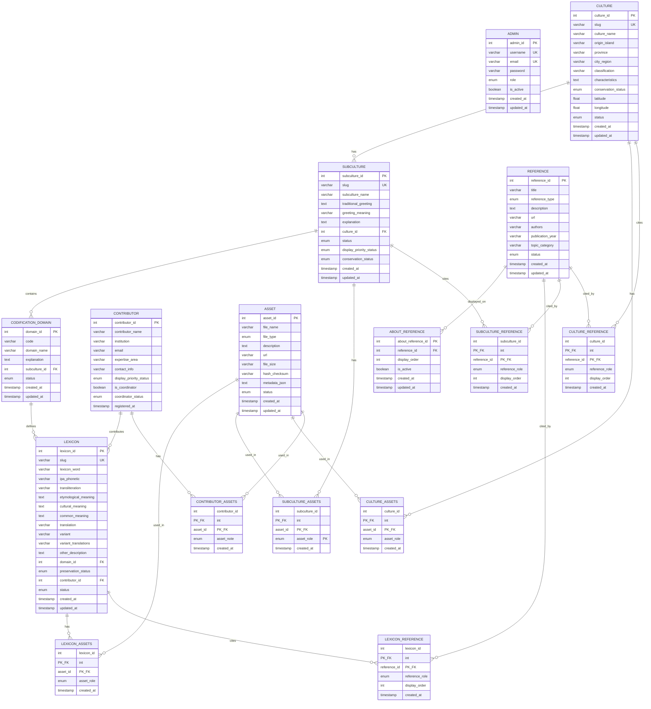

# ERD Mermaid - Leksikon Database

## Crow's Foot ERD Diagram

## Simplified ERD (Core Entities Only)

## Crow's Foot Notation Legend

| Symbol | Meaning |
|--------|---------|
| `\|\|` | One (mandatory) |
| `\|o` | Zero or One (optional) |
| `o{` | Zero or Many |
| `\|{` | One or Many |
| `--` | Relationship line |
| `PK` | Primary Key |
| `FK` | Foreign Key |
| `UK` | Unique Key |

## Entity Colors (for Visual Paradigm / draw.io)

| Entity Type | Color | Hex Code |
|-------------|-------|----------|
| Main Entities | Light Blue | #E3F2FD |
| Junction Tables | Light Orange | #FFF3E0 |
| Enum Values | Light Purple | #F3E5F5 |
| Primary Keys | Gold | #FFD700 |
| Foreign Keys | Tomato | #FF6347 |

---

*Generated from Prisma Schema - December 2025*
